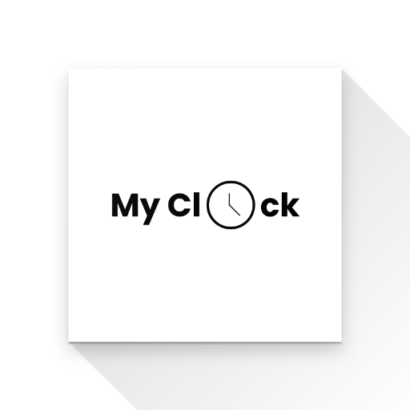

# My Clock

## Introduction

A basic clock app in flutter. It has a clock, stopwatch and timer.

## Statemanagement

For state management and dependency injection, this app uses [GetX flutter package](https://pub.dev/packages/get).

## Themes available

- Black & White

## Available on

- ### [Playstore](https://play.google.com/store/apps/details?id=com.moulibheemaneti.my_clock)